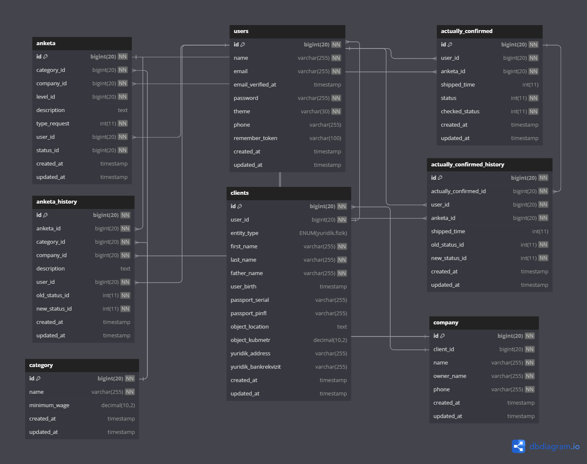

## About Template

This is ready admin panel template with
- [Laravel 8](https://laravel.com/docs/8.x)
- [Laravel-permissions (Spatie.be)](https://spatie.be/docs/laravel-permission/v3/introduction)
- [Authorization laravel/ui](https://github.com/laravel/ui)

Laravel is accessible, powerful, and provides tools required for large, robust applications.

## DB



## Iframe

<iframe src="https://dbdiagram.io/d/664f2659f84ecd1d22f46bcf" width="100" height="100" style="margin: auto; display: flex;justify-content: center; width: 100%; height: 900px;" frameborder="0"></iframe>


## bugs clean code qlsh kere
```
cdn lani ob tashash kere
table ga exel qoshish kere +++
multi company create qlsh kere +++
database skeletini korb chqsh kere 


composer require maatwebsite/excel +++

php artisan make:export ProductsExport --model=Products


bolib tolanadigan kvartllar soni +++

1) mi to'lanishi kerak bo'gan miqdor * Bo'lib to'lash foizi oldindan = 

input polya tuzutsh kere +++

Yurik: Kompanya nomi,Raxbar FIO, Passport datas(nullable), ID-CARD,  Manzili, Xisobvaraq, Bank kodi, CTIR, OKED,  Xizmat korstavchi bank, TEL,

Fizik: FIO, Manzili, Passport datas, Tel,ID-CARD,

bank kod = 5 +++

mestapalojenya comp keermas ++++
 
Юридический реквизит = xisob raqam +++

Jamg'arma Rekviztlari = keremas +++

id passport radio blan qoshish kere +++

enter btn = disabled +++

accardion default open +++

naxt va rasrochka option qoysh kere naxt boganda foiz kratdgan input disable bolsh kere +++

yashash manzili +++

Passport sanasi = type +++

shulani products/show ga chqazsh kere +++

product edit fix qlish kere +++

request history qlish kere +++

file upload qilish kere +++

product showga table chqazsh kere kredit xoblab beradgan +++

familya imya otchestva +++

file upload ui chiroyli qlish kere +++

blade digi textlani jsondan chqab qilish kere +++

product edit textlani fix qlish kere +++

multiple doc download qilish kere branch xar xil qilib exelgayam shu +++

role permissionlani korvorsh kere +++

edit blade ga xamma value lani chqash kere +++

daily backup qilish kere schedule blan

audit logs user friendly qilish kere

product add / edit qvotganda validatsalani check qb chiqish kere

textlani fix qilish kere

period fix qilish kere

blade clean qilish kere 

edit input laga date qoshish kere +++

edit mijoz_turi eski datani olishi 


```


<a href="https://wordtohtml.net/">https://wordtohtml.net/</a>

shu sayt blan word ni html qvolamza

```
composer require maatwebsite/excel
```

composer require barryvdh/laravel-debugbar

php artisan vendor:publish --provider="Barryvdh\Debugbar\ServiceProvider"--tag="config"